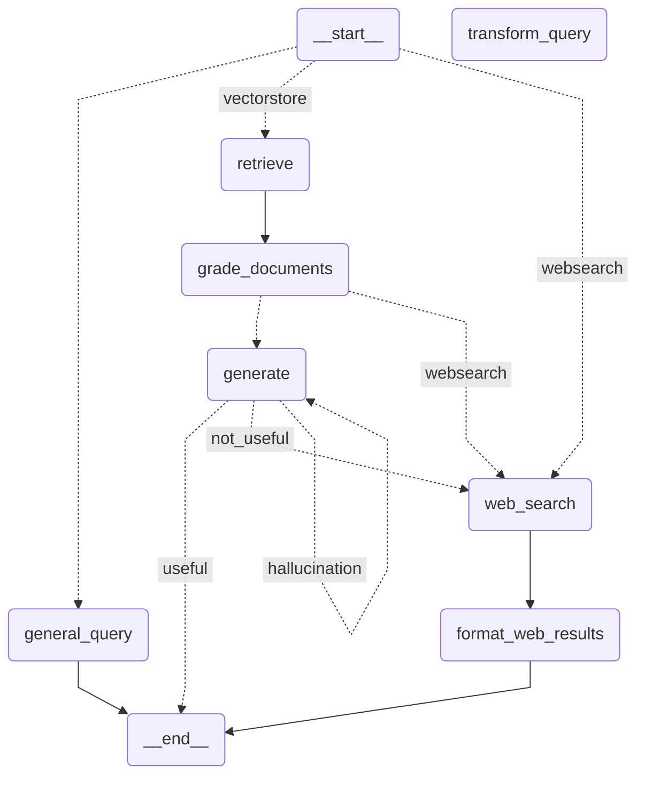

```mermaid
---
config:
  flowchart:
    curve: linear
---
graph TD;
	__start__(<p>__start__</p>)
	retrieve(retrieve)
	grade_documents(grade_documents)
	generate(generate)
	transform_query(transform_query)
	web_search(web_search)
	format_web_results(format_web_results)
	general_query(general_query)
	__end__(<p>__end__</p>)
	__start__ -.-> general_query;
	__start__ -. &nbsp;vectorstore&nbsp; .-> retrieve;
	__start__ -. &nbsp;websearch&nbsp; .-> web_search;
	generate -. &nbsp;useful&nbsp; .-> __end__;
	generate -. &nbsp;not_useful&nbsp; .-> web_search;
	grade_documents -.-> generate;
	grade_documents -. &nbsp;websearch&nbsp; .-> web_search;
	retrieve --> grade_documents;
	web_search --> format_web_results;
	format_web_results --> __end__;
	general_query --> __end__;
	generate -. &nbsp;hallucination&nbsp; .-> generate;
	classDef default fill:#f2f0ff,line-height:1.2
	classDef first fill-opacity:0
	classDef last fill:#bfb6fc

```